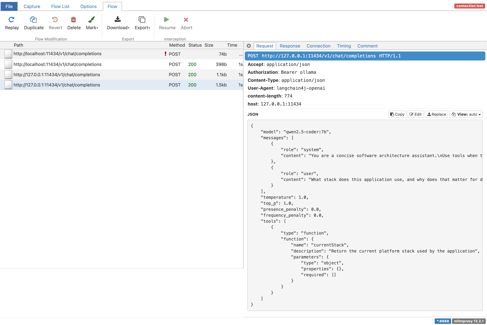

# You’re Flying Blind: Intercepting Local Ollama Traffic with mitmproxy

Most developers think local models are easier to debug because they run on the same machine as the application. You start Ollama, point your Java client at `localhost:11434`, get a response back, and assume the transport side is simple. That feeling lasts until the answers get worse, latency goes up, or a tool call starts doing strange things.

The model is only one part of the story. The full serialized request drives behavior too. Your Java code creates a clean interface method. The framework turns that into JSON. Then the model sees the final payload: system prompt, user message, tool schema, generation settings, and anything else your client sends. If that payload is too large or shaped differently than you expected, the model behaves differently. Application logs often miss that final shape.

This gets worse when you use OpenAI-compatible APIs. The same request format can target OpenAI, LiteLLM, or Ollama. That is good for portability, but it also makes it easy to ignore what is actually going over the wire. Ollama supports an OpenAI-compatible `/v1/chat/completions` endpoint on `http://localhost:11434/v1/`, and that makes it a very good local target for this kind of inspection. It also supports tools on that endpoint; see the [Ollama OpenAI compatibility documentation](https://docs.ollama.com/api/openai-compatibility).

`mitmproxy` solves this problem by showing the real HTTP traffic. For local Ollama over plain HTTP, this is much simpler than the hosted HTTPS case. You do not need to trust a custom CA certificate for the main path in this tutorial, because we are not intercepting TLS here. We are just routing normal HTTP traffic through a local proxy. `mitmweb` runs the proxy on the listen port you choose and serves the web UI on `127.0.0.1:8081` by default; see [mitmweb](https://docs.mitmproxy.org/stable/#mitmweb) in the mitmproxy documentation.

What follows is a small Quarkus application that talks to Ollama through its OpenAI-compatible endpoint. We route that traffic through `mitmproxy`, compare a plain request with a tool-enabled request, and inspect what really hits the model. The useful outcome is simple: you can see the same payload your model sees. Quarkus LangChain4j supports named model configurations, AI services with `@RegisterAiService`, and tool integration with `@Tool`, so we keep the Java code small and still get a realistic payload on the wire; see [Quarkus LangChain4j AI services](https://docs.quarkiverse.io/quarkus-langchain4j/dev/ai-services.html).

## Prerequisites

You need a local Java setup, a running Ollama installation, and `mitmproxy`. I assume you are comfortable with Quarkus REST endpoints and Maven, but I do not assume you already know the LangChain4j annotations used here.

* Java 21 or newer installed (validated with Java 25)
* Quarkus CLI installed
* Ollama installed locally
* `mitmproxy` installed locally (`brew install --cask mitmproxy` on macOS)
* Basic understanding of REST endpoints

## Project Setup

Create the project or grab it from my Github repository.

```bash
quarkus create app com.example:ollama-wiretap-demo \
  --package-name=com.example.ollamawiretap \
  --extension=rest-jackson,io.quarkiverse.langchain4j:quarkus-langchain4j-openai  \
  --no-code
```

We use `rest-jackson` because we want a simple JSON REST endpoint in Quarkus REST. We use `quarkus-langchain4j-openai` on purpose, even though the model is local. The reason is simple: Ollama exposes an OpenAI-compatible API, so this lets us inspect the same wire format many teams use against hosted providers later. The Quarkus extension page documents the Ollama integration too, but for this article the OpenAI-compatible path is the better teaching tool; see the [Quarkus REST Jackson extension](https://quarkus.io/extensions/io.quarkus/quarkus-rest-jackson/).

Change into the project directory:

```bash
cd ollama-wiretap-demo
```

## Implementation

### Create the request and response types

We start with two small records. They keep the REST endpoint simple, and they also make verification easier because the HTTP response shape stays stable even though the model output itself is not deterministic.

Create `src/main/java/com/example/ollamawiretap/PromptRequest.java`:

```java
package com.example.ollamawiretap;

public record PromptRequest(String question) {
}
```

Create `src/main/java/com/example/ollamawiretap/PromptResponse.java`:

```java
package com.example.ollamawiretap;

public record PromptResponse(String mode, String answer, long durationMs) {
}
```

This gives us a stable contract. The answer text changes from run to run. The `mode` and `durationMs` fields do not. That matters for AI verification. We do not test exact wording. We test that the call went through the expected path and that we can inspect the request that produced it.

### Create a plain AI service

Create the first AI service next. This is our baseline. It has a short system prompt and no tools.

Create `src/main/java/com/example/ollamawiretap/PlainAssistant.java`:

```java
package com.example.ollamawiretap;

import dev.langchain4j.service.SystemMessage;
import dev.langchain4j.service.UserMessage;
import io.quarkiverse.langchain4j.RegisterAiService;

@RegisterAiService
public interface PlainAssistant {

    @SystemMessage("""
            You are a concise software architecture assistant.
            Answer in no more than four sentences.
            Be concrete.
            """)
    String answer(@UserMessage String question);
}
```

This interface is small, but it still routes through the OpenAI client configured in `application.properties`. We keep a single default model configuration so the proxy path is explicit and easy to validate; see [Quarkus LangChain4j AI services](https://docs.quarkiverse.io/quarkus-langchain4j/dev/ai-services.html).

The guarantee here is simple. Every call to `answer` becomes a chat-completions request. The limit is also simple. This does not tell you anything about payload size unless you inspect the traffic. The Java method hides the JSON. That is the whole problem we are solving.

### Create a tool bean

Add a CDI bean with a tool method. The Quarkus LangChain4j AI services reference shows the `@Tool` pattern for function calling. We will use a tiny tool on purpose so the traffic difference is easy to understand; see [Quarkus LangChain4j AI services](https://docs.quarkiverse.io/quarkus-langchain4j/dev/ai-services.html).

Create `src/main/java/com/example/ollamawiretap/ArchitectureTools.java`:

```java
package com.example.ollamawiretap;

import dev.langchain4j.agent.tool.Tool;
import jakarta.enterprise.context.ApplicationScoped;

@ApplicationScoped
public class ArchitectureTools {

    @Tool("Return the current platform stack used by the application")
    public String currentStack() {
        return "Java, Quarkus, Ollama, mitmproxy";
    }
}
```

This tool does almost nothing. That is fine for this tutorial. It makes the request larger and different on the wire. Once tools are available, the model call includes tool metadata. Teams often forget this overhead when they discuss context budgets.

### Create a tool-enabled AI service

The second AI service keeps the same basic behavior, but with tool access enabled.

Create `src/main/java/com/example/ollamawiretap/ToolAssistant.java`:

```java
package com.example.ollamawiretap;

import dev.langchain4j.service.SystemMessage;
import dev.langchain4j.service.UserMessage;
import io.quarkiverse.langchain4j.RegisterAiService;

@RegisterAiService(tools = {ArchitectureTools.class})
public interface ToolAssistant {

    @SystemMessage("""
            You are a concise software architecture assistant.
            Use tools when they help answer the question.
            Answer in no more than four sentences.
            Be concrete.
            """)
    String answer(@UserMessage String question);
}
```

This is where the transport story gets interesting. The Java code barely changed. The request body did. That difference is invisible at the call site, but it is visible in mitmproxy.

### Create the REST endpoint

Finish with a REST endpoint that lets us call either mode. We use a path parameter so we can compare `plain` and `tool` without changing code between runs.

Create `src/main/java/com/example/ollamawiretap/PromptResource.java`:

```java
package com.example.ollamawiretap;

import jakarta.inject.Inject;
import jakarta.ws.rs.BadRequestException;
import jakarta.ws.rs.Consumes;
import jakarta.ws.rs.POST;
import jakarta.ws.rs.Path;
import jakarta.ws.rs.PathParam;
import jakarta.ws.rs.Produces;
import jakarta.ws.rs.core.MediaType;

@Path("/inspect")
@Consumes(MediaType.APPLICATION_JSON)
@Produces(MediaType.APPLICATION_JSON)
public class PromptResource {

    @Inject
    PlainAssistant plainAssistant;

    @Inject
    ToolAssistant toolAssistant;

    @POST
    @Path("/{mode}")
    public PromptResponse inspect(@PathParam("mode") String mode, PromptRequest request) {
        long start = System.currentTimeMillis();

        String answer = switch (mode) {
            case "plain" -> plainAssistant.answer(request.question());
            case "tool" -> toolAssistant.answer(request.question());
            default -> throw new BadRequestException("Mode must be 'plain' or 'tool'");
        };

        long duration = System.currentTimeMillis() - start;
        return new PromptResponse(mode, answer, duration);
    }
}
```

This endpoint gives us a clean comparison point. Both requests come from the same application, hit the same Ollama server, and go through the same proxy. The only thing that changes is the AI service configuration.

Under stress, this code is still synchronous. That is fine for the tutorial. For higher throughput systems, you would care about concurrency, request queuing, and timeouts much more explicitly. But for inspecting payload shape, a blocking REST endpoint is the easiest thing to reason about at 2am.

## Configuration

Configure the application in `src/main/resources/application.properties`:

```properties
quarkus.langchain4j.openai.base-url=http://127.0.0.1:11434/v1
quarkus.langchain4j.openai.api-key=ollama
quarkus.langchain4j.openai.proxy-type=HTTP
quarkus.langchain4j.openai.proxy-host=127.0.0.1
quarkus.langchain4j.openai.proxy-port=8888
quarkus.langchain4j.openai.chat-model.model-name=qwen2.5-coder:7b
quarkus.langchain4j.openai.chat-model.log-requests=true
quarkus.langchain4j.openai.chat-model.log-responses=true
```

Each setting matters.

Source note: `quarkus.http.port` is a core Quarkus property documented in the Quarkus config reference, while the `quarkus.langchain4j.openai.*` keys are extension properties documented in the Quarkiverse LangChain4j configuration reference.

`quarkus.langchain4j.openai.base-url` points the OpenAI client at Ollama’s OpenAI-compatible endpoint. I use `127.0.0.1` here to avoid localhost edge-cases around IPv6 and proxy bypass in some environments. Ollama documents `http://localhost:11434/v1/` too, and also documents that `api_key='ollama'` is required by some OpenAI clients but ignored by Ollama locally; see the [Ollama OpenAI compatibility documentation](https://docs.ollama.com/api/openai-compatibility).

`proxy-type`, `proxy-host`, and `proxy-port` route the OpenAI-compatible client through mitmproxy. The value `8888` is arbitrary, but it must be a port where mitmproxy is actually listening, and it must not be the same port Quarkus uses for its own HTTP server (`quarkus.http.port`). The Quarkus LangChain4j OpenAI model docs expose these proxy properties directly; see [Quarkus LangChain4j OpenAI chat model configuration](https://docs.quarkiverse.io/quarkus-langchain4j/dev/openai-chat-model.html).

`chat-model.model-name=qwen2.5-coder:7b` selects the local Ollama model. The exact model is your choice. Use one that is already comfortable on your machine. `log-requests` and `log-responses` are useful here because they let you compare framework-level logging with the real wire capture. The logs help. The wire is still the source of truth; those switches are documented with the other OpenAI named-model settings in [Quarkus LangChain4j OpenAI chat model configuration](https://docs.quarkiverse.io/quarkus-langchain4j/dev/openai-chat-model.html).

This configuration gives you one clear guarantee. The Quarkus client will call Ollama through mitmproxy. It does not guarantee the model will use the tool on every request. Tool use is still model behavior, and that is probabilistic.

## Running the Stack

While writing this article, the demo initially used the LangChain4j versions aligned by the Quarkus platform BOM alone. On that combination, the OpenAI client did not honor the proxy-related `application.properties` keys, so requests never reached mitmproxy even though the configuration looked correct. We had to bump the Quarkus LangChain4j stack: the companion `pom.xml` imports `io.quarkiverse.langchain4j:quarkus-langchain4j-bom` at **1.8.4**, which picks up the upstream fix in [quarkus-langchain4j#2276](https://github.com/quarkiverse/quarkus-langchain4j/pull/2276) (“Make sure `quarkus.langchain4j.proxy*` settings work”).

**Note:** The `quarkus.langchain4j.openai.proxy-type`, `proxy-host`, and `proxy-port` settings from the Configuration section are the ones this walkthrough relies on. Match or exceed that BOM version (or a release that includes the same fix) so those properties actually configure the HTTP client; otherwise you may need the JVM `-Dhttp.proxyHost=...` workaround below even when the Quarkus keys are set.

Pull a model if you do not already have one:

```bash
ollama pull qwen2.5-coder:7b
```

Start Ollama:

```bash
ollama serve
```

Ollama’s OpenAI compatibility docs show the local base URL and the `/v1/chat/completions` endpoint shape; see the [Ollama OpenAI compatibility documentation](https://docs.ollama.com/api/openai-compatibility).

Now start mitmproxy:

```bash
mitmweb --listen-port 8888
```

This starts the proxy on port `8888` and the web UI on `http://127.0.0.1:8081` by default; see [mitmweb](https://docs.mitmproxy.org/stable/#mitmweb) in the mitmproxy documentation.

Important with newer mitmproxy releases: the web UI is protected by a one-time auth token. If you open `http://127.0.0.1:8081/#/capture` and get HTTP 403, check the `mitmweb` terminal output, copy the token/password shown there, and enter it in the browser form once for that session.

After that, start the Quarkus app:

```bash
./mvnw quarkus:dev
```

If requests still do not appear in mitmproxy, force JVM-level proxy settings for the Quarkus process:

```bash
./mvnw quarkus:dev \
  -Dhttp.proxyHost=127.0.0.1 \
  -Dhttp.proxyPort=8888 \
  -Dhttps.proxyHost=127.0.0.1 \
  -Dhttps.proxyPort=8888 \
  -Dhttp.nonProxyHosts=
```

Before sending runtime requests, run the fast safety check:

```bash
./mvnw test
```

At this point the runtime path is:

`curl` → Quarkus on port `8080` → mitmproxy on port `8888` → Ollama on port `11434`

That is the path we care about. There is no hidden gateway and no hosted provider. You are looking at the traffic leaving your Java application and arriving at your local model server.

This walkthrough targets JVM dev mode (`quarkus:dev`). Turning the same app into a native executable with LangChain4j is a separate exercise and not covered here.

## Production Hardening

Keep mitmproxy as a development and incident tool, not as default production architecture. It stores prompts, tool definitions, and model responses in one more place. If those payloads contain internal data, customer data, or secrets, the proxy now becomes part of your data boundary.

Account for latency before you compare model performance. Even on localhost, the extra proxy hop adds overhead. If you benchmark with mitmproxy enabled and then benchmark without it, you can separate model latency from client serialization and proxy cost.

Treat transport mode as environment-specific. In this tutorial we use plain local HTTP, so there is no CA trust setup. For HTTPS targets, mitmproxy must terminate TLS and your client must trust the mitmproxy CA. That is a different security and ops posture; see [About certificates](https://docs.mitmproxy.org/stable/concepts/certificates/) in the mitmproxy documentation.

Use this capture workflow when behavior changes after enabling tools or adding memory. At that point, inspect the JSON payload size and shape first, then tune prompts or tool design. This ties back to the opening problem: debugging model output without inspecting transport data is mostly guesswork.

## Verification

### Compare a plain request and a tool-enabled request

Send the plain request first:

```bash
curl -s http://localhost:8080/inspect/plain \
  -H 'Content-Type: application/json' \
  -d '{"question":"Explain why large prompts increase latency."}'
```

Expected response shape:

```json
{
  "mode": "plain",
  "answer": "...",
  "durationMs": 1234
}
```

Now send the tool-enabled request:

```bash
curl -s http://localhost:8080/inspect/tool \
  -H 'Content-Type: application/json' \
  -d '{"question":"What stack does this application use, and why does that matter for debugging?"}'
```

Expected response shape:

```json
{
  "mode": "tool",
  "answer": "...",
  "durationMs": 1450
}
```

We are not verifying exact wording. This is an AI system. We verify that both calls return JSON, that the `mode` field matches the endpoint used, and that each request creates a captured flow in mitmproxy.

In the companion Maven tree, `./mvnw test` runs a `@QuarkusTest` that POSTs to `/inspect/not-a-mode` and expects HTTP `400`, so invalid `mode` values fail fast without Ollama or mitmproxy.

### Inspect the wire

Open the token URL printed by `mitmweb` (for example `http://127.0.0.1:8081/?token=...`) and use this filter:

```text
~u /v1/chat/completions
```

In the capture UI, you should see something like this once requests are flowing:



You should see both requests. Open the plain request first. The body will contain `model`, a `messages` array, and your system and user messages. That is the real payload Ollama receives on the OpenAI-compatible endpoint. Ollama documents this endpoint and its supported features, including tools; see the [Ollama OpenAI compatibility documentation](https://docs.ollama.com/api/openai-compatibility).

Now open the tool-enabled request. The key difference is tool metadata in the JSON. Your Java endpoint stays the same while the payload grows.

If the model decides to call the tool, you will also see the multi-step exchange. First the model asks for the tool. Then your application executes it. Then the tool result goes back to the model. That round-trip cost is easy to ignore when all you look at is one neat Java method call.

### Compare mitmproxy with application logs

Because `log-requests` and `log-responses` are enabled, Quarkus will also log model traffic. This is useful, but it is still not the same as the wire capture. The logs are whatever the client library decided to print. Mitmproxy shows the actual request that crossed the proxy boundary. When the two differ, trust the wire; see [Quarkus LangChain4j OpenAI chat model configuration](https://docs.quarkiverse.io/quarkus-langchain4j/dev/openai-chat-model.html).

## Conclusion

We built a Quarkus app that calls a local Ollama model through the OpenAI-compatible endpoint, routed that traffic through `mitmproxy`, and compared plain vs tool-enabled payloads on the wire. The practical outcome is simple: when answers get weird, you can inspect the exact JSON the model received, instead of guessing from abstractions.

The runnable Maven tree for this post lives under `ollama-wiretap-demo/` in [the-main-thread-preview repository on GitHub](https://github.com/meisele/the-main-thread-preview).