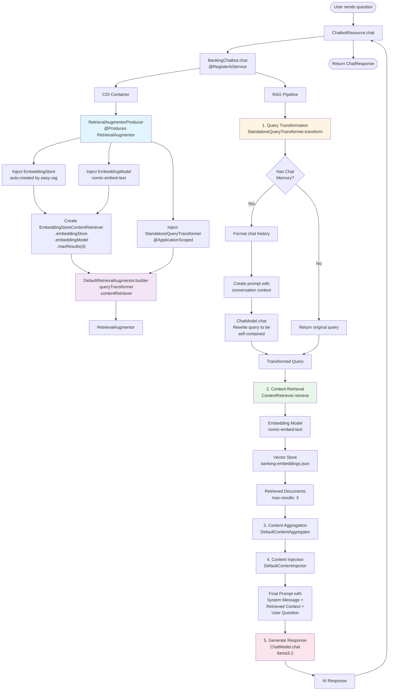

# Easy RAG Flow with RetrievalAugmentorProducer



## Component Architecture

```mermaid
graph TB
    subgraph "CDI Container"
        Producer[RetrievalAugmentorProducer<br/>@ApplicationScoped]
        Transformer[StandaloneQueryTransformer<br/>@ApplicationScoped]
        EmbedStore[EmbeddingStore<br/>Auto-created by easy-rag]
        EmbedModel[EmbeddingModel<br/>Ollama nomic-embed-text]
    end
    
    subgraph "REST Layer"
        Resource[ChatbotResource<br/>@Path /chat]
    end
    
    subgraph "AI Service"
        Service[BankingChatbot<br/>@RegisterAiService]
    end
    
    subgraph "RAG Components"
        Augmentor[RetrievalAugmentor<br/>@Produces]
        Retriever[ContentRetriever<br/>Created in Producer]
        Aggregator[ContentAggregator<br/>Default]
        Injector[ContentInjector<br/>Default]
    end
    
    subgraph "Models"
        ChatModel[ChatModel<br/>Ollama llama3.2]
    end
    
    subgraph "Storage"
        VectorStore[Vector Store<br/>banking-embeddings.json]
        Documents[Document Store<br/>src/main/resources/documents]
    end
    
    Resource -->|@Inject| Service
    Service -->|Uses| Augmentor
    Producer -->|@Produces| Augmentor
    Producer -->|@Inject| EmbedStore
    Producer -->|@Inject| EmbedModel
    Producer -->|@Inject| Transformer
    Producer -->|Creates| Retriever
    Augmentor -->|Uses| Transformer
    Augmentor -->|Uses| Retriever
    Retriever -->|Uses| EmbedStore
    Retriever -->|Uses| EmbedModel
    EmbedModel -->|Queries| VectorStore
    VectorStore -->|Indexes| Documents
    Transformer -->|Uses| ChatModel
    Service -->|Uses| ChatModel
    
    style Producer fill:#e1f5ff
    style Transformer fill:#fff4e1
    style Augmentor fill:#f3e5f5
    style Service fill:#e8f5e9
```
