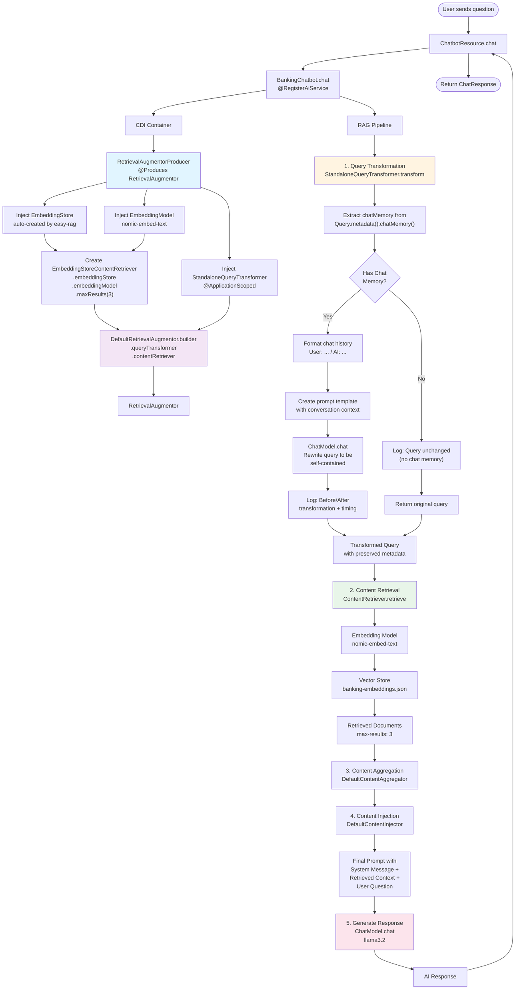
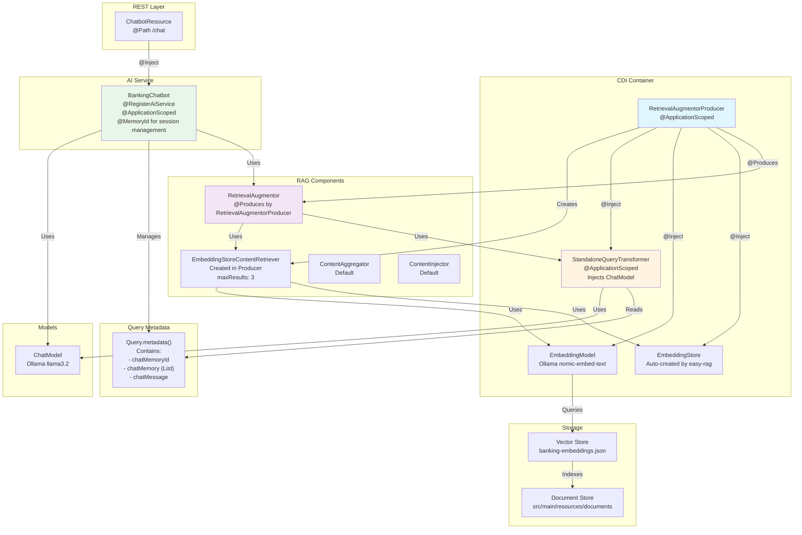

# Easy RAG Flow with RetrievalAugmentorProducer

## Component Architecture

## Key Implementation Details

### Query Transformation Flow

1. **Query Metadata Access**: The `StandaloneQueryTransformer` reads chat memory directly from `Query.metadata().chatMemory()`. This is populated by the LangChain4j framework when using `@RegisterAiService` with `@MemoryId`.

2. **Chat Memory Check**: 
   - If `chatMemory` is `null` or empty, the transformer returns the original query unchanged (first message in a conversation)
   - If chat memory exists, it formats the conversation history and uses an LLM to rewrite the query to be self-contained

3. **Logging**: The transformer logs:
   - Original query text (before transformation)
   - Transformed query text (after transformation)
   - Transformation duration in milliseconds
   - Query unchanged message when no chat memory is present

4. **Metadata Preservation**: The transformed query preserves the original query's metadata, ensuring chat memory ID and other context is maintained.

### Component Dependencies

- **RetrievalAugmentorProducer**: Creates the `RetrievalAugmentor` by combining:
  - `EmbeddingStoreContentRetriever` (built from `EmbeddingStore` and `EmbeddingModel`)
  - `StandaloneQueryTransformer` (injected as a CDI bean)

- **StandaloneQueryTransformer**: 
  - Injects `ChatModel` for query rewriting
  - Uses `PromptTemplate` to format the transformation prompt
  - Formats chat history as "User: ..." and "AI: ..." messages

### Chat Memory Behavior

- Chat memory is managed by the `@RegisterAiService` framework
- The `@MemoryId` parameter in `BankingChatbot.chat()` identifies the session
- Query metadata includes `chatMemoryId` and `chatMemory` (list of previous messages)
- On the first message, `chatMemory` will be empty, so no transformation occurs
- On subsequent messages, `chatMemory` contains previous exchanges, enabling query rewriting
